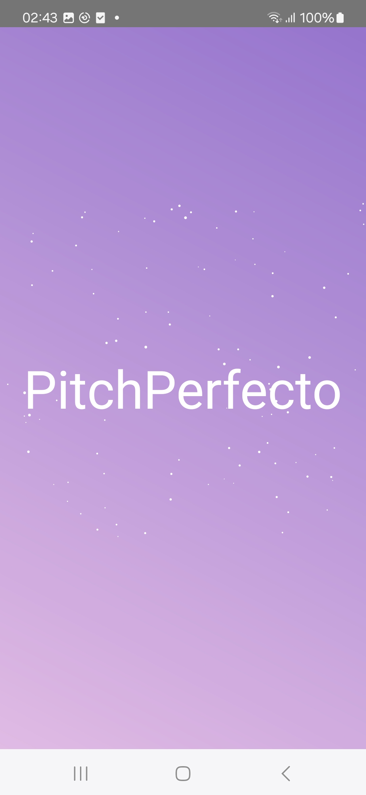
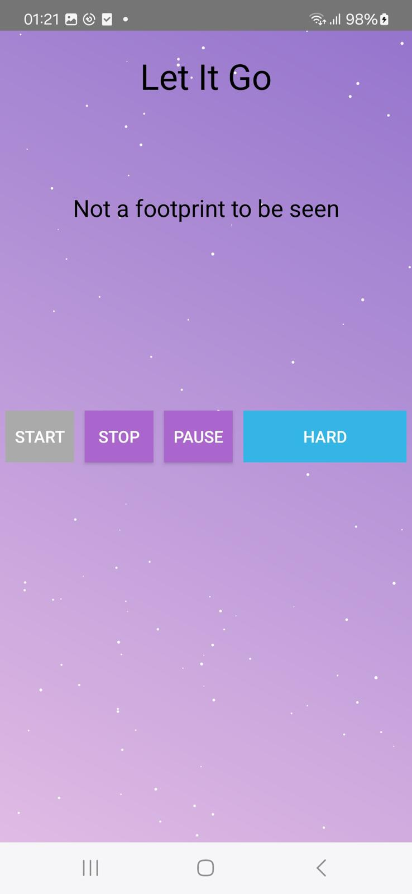
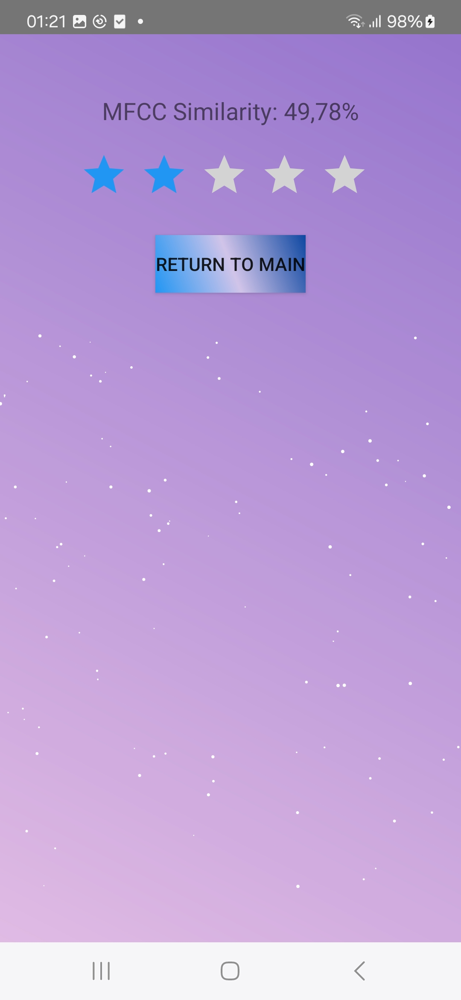
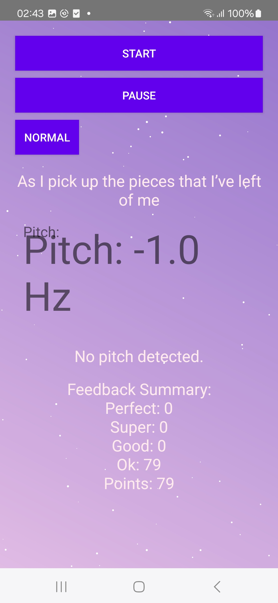

# PitchPerfecto
The karaoke app „PitchPerfecto“ is an innovative karaoke app that analyzes the user's singing and provides personalized feedback. Users sing along to a song with the lyrics displayed in real time. After the performance, the app analyzes the singing using machine learning and provides visual feedback. It also includes a simple feedback system and ensures that licensing rights for the music tracks are respected.
 

# Installation
In order to install PitchPerfecto on your Android device, you will need to download our latest release with the PitchPerfectot.apk file, which can be found in this repository. Then tap the downloaded .apk file to install the app. The app should now be available on your phone.

# Usage
First use: When you open PitchPerfecto for the first time, the app will ask you to allow the use of the microphone. In order for the app to work as expected, the app must receive the necessary permissions. Now you are ready to choose a song that you would like to sing.
 

Once you have decided which song you want to sing, you can choose which mode you would like to play.

The first one you see is the classic mode, where only your pitch is compared to the original pitch of the song. This is for those who want to get started, or for those who just want to enjoy themselves.

  
  

The second and final mode is for experts or those who want a bit more of a challenge. Here you get real-time feedback on how you're singing. You'll be able to see what frequency you're singing at, and you'll end up with a final score, and the more perfect you get, the better your final score will be.

# Internal analysis process
The songs have been separated beforehand and the lyrics are synchronised using lrc files. Now for the classic mode, JLibrosa compares both MFCC (Mel-Frequency Cepstral Coefficients) values. For the hard mode, TarsosDSP allows you to experience real time feedback where your frequency is compared to the original song and you get feedback like "ok", "good", "super" and "perfect" (sorted by score from bad to good). The better you are, the higher your real score will be.

# credits:
Music: "Somebody.mp3" by Nexto (CC BY 4.0) 
Link to License: https://creativecommons.org/licenses/by/4.0/

Music: "Louder Than the Liar | MAGA Trump Cult Liars" by John Lopker (CC BY 4.0)
Link to License: https://creativecommons.org/licenses/by/4.0/

This project includes the following libraries with their respective licenses:

  1. Apache Commons Math - Apache License 2.0

  2. JLibrosa, Android-Wave-Recorder - MIT License

  3. TarsosDSP - GPL-3.0 license

